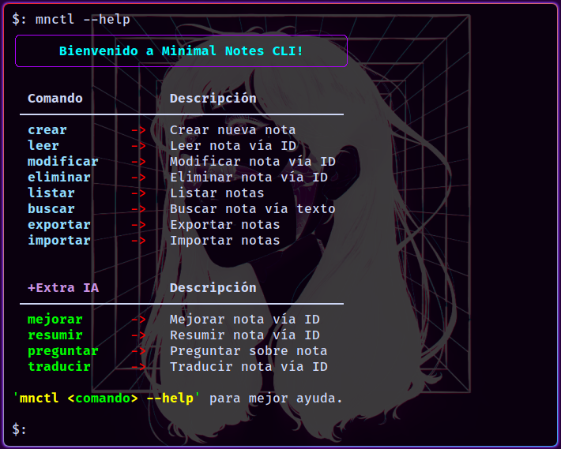
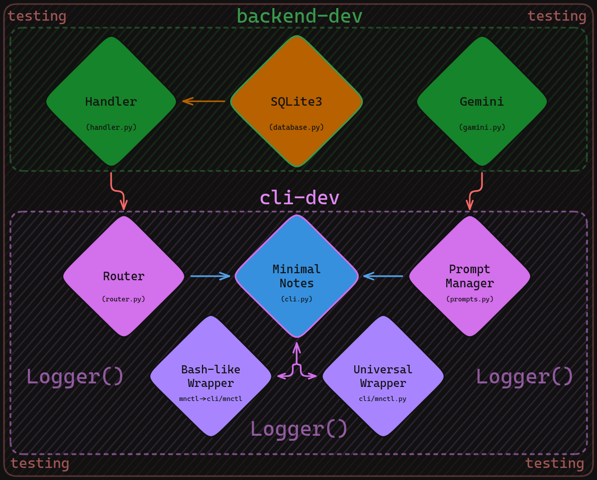

<p align="center">
  <h1 align="center">🗒️ Minimal Notes CLI</h1>
  <p align="center"><i>Typer CLI inteligente para gestión de notas con SQLite3 y procesamiento de IA</i></p>
  <p align="center">
    <a href="https://opensource.org/licenses/MIT">
      
    </a>
    <a href="https://python.org/">
      
    </a>
    
    
  </p>
</p>

---

## 🎯 ¿Qué es Minimal Notes?

Sistema de notas (**Typer CLI**) **production-ready** que combina persistencia local (**SQLite3**) con capacidades de IA para automatizar mejoras, resúmenes y procesamiento de contenido. Arquitectura modular diseñada para escalabilidad y mantenibilidad.

```bash
# Workflow típico
mnctl crear "Arquitectura microservicios: API Gateway + Redis cache"
mnctl listar                    # ID | Fecha | Preview
mnctl buscar "microservicios"   # Búsqueda full-text
mnctl mejorar 1                 # IA optimiza estructura y contenido
mnctl traducir 1 "english"     # Deploy internacional
```

## 📸 Vista Superficial



## ⚡ Features Core

<table>
<tr>
<td><b>🔧 CRUD Completo</b></td>
<td>Create, Read, Update, Delete con indexación SQLite</td>
</tr>
<tr>
<td><b>🔍 Búsqueda Integrada</b></td>
<td>Full-text search </td>
</tr>
<tr>
<td><b>📁 Import/Export</b></td>
<td>Interoperabilidad con ecosistema de archivos</td>
</tr>
<tr>
<td><b>🤖 IA Integrada</b></td>
<td>Mejora, resumen, Q&A y traducción automática</td>
</tr>
<tr>
<td><b>⚙️ Zero Config</b></td>
<td>Funciona out-of-the-box, sin setup complejo</td>
</tr>
<tr>
<td><b>💾 Local-First</b></td>
<td>SQLite embebido, sin dependencias cloud</td>
</tr>
</table>

## 🚀 Instalación

**Requisitos:** 
- Dependencias **Python 3.10+**: `pip install -r requirements.txt`
- **Gemini API**: `GEMINI_API_KEY` dentro de `.env` en raíz del proyecto.

> **Nota:** Hay un `.env.example` de ejemplo que podes copiar. 
### Linux/macOS

```bash
git clone https://github.com/uCoders-Devs/minimal-notes.git
cd minimal-notes
chmod +x mnctl
./mnctl --help
```

### Windows

```cmd
git clone https://github.com/uCoders-Devs/minimal-notes.git
cd minimal-notes
python cli/mnctl.py --help
```

> **Windows users:** Usa `python cli/mnctl.py` en lugar de `./mnctl`

## 💡 Demo Rápida

```bash
# Gestión básica
mnctl crear "Bug crítico: memory leak en auth middleware"
mnctl leer 1
mnctl modificar 1 "FIXED: memory leak resuelto con proper cleanup"

# Funciones avanzadas
mnctl buscar "memory leak"
mnctl exportar 1 --filename "hotfix-log.txt"
mnctl importar "requirements.txt"

# IA Pipeline
mnctl mejorar 2                           # Optimiza estructura
mnctl resumir 2                          # Executive summary
mnctl preguntar 2 "¿Cuáles son los TODOs?" # Context-aware Q&A
mnctl traducir 2 "english"               # i18n ready
```

## 🏗️ Arquitectura



-   **Separation of Concerns**: Database -> Handler -> Router -> CLI *(layers)*
-   **Modular Design**: Componentes reutilizables e intercambiables
-   **UNIX Philosophy**: Do one thing, do it well

## 📚 Documentación

-   **Uso completo**: [`docs/MNCTL.md`](docs/MNCTL.md)
-   **Detalles técnicos**: Rama `testing`
-   **Testing logs**: `data/log/`

## 🔧 Development

```bash
# Setup dev environment
git checkout testing
chmod +x mnctl
./mnctl --test           # Run bash test suite
```

---

  <h2 align="center">👥 Team</h2>

<table align="center">
<tr>
<td align="center">
<a href="https://github.com/Tomas-SC"><br /><b>Tomas-SC</b></a><br/>Architecture & Backend
</td>
<td align="center">  
<a href="https://github.com/bluware-dev"><br /><b>Blu</b></a><br/>CLI & Integration
</td>
</tr>
</table>

---

<p align="center">
  <b>📄 MIT License</b> • 
  <b>🐍 Python 3.10+</b> • 
  <b>🔄 v0.1.0-alpha</b>
</p>
